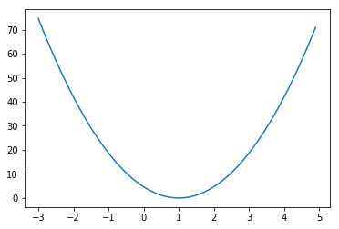

```python
# cost 함수 그려보기

import tensorflow as tf
import matplotlib.pyplot as plt  # tensorflow 환경에서 pip install matplotlib 입력하여 설치

# 그래프 정의
X = [1, 2, 3]
Y = [1, 2, 3]
W = tf.placeholder(tf.float32)
hypothesis = W * X  # 단순화
cost = tf.reduce_mean(tf.square(hypothesis - Y))

sess = tf.Session()
sess.run(tf.global_variables_initializer())

# W, cost 결과를 담을 배열 정의
W_val = []
cost_val = []

for i in range(-30, 50):
    feed_W = i * 0.1  # -3.0 ~ 5.0
    curr_cost, curr_W = sess.run([cost, W], feed_dict = {W: feed_W})
    # 배열에 값 넣기
    W_val.append(curr_W)
    cost_val.append(curr_cost)

# 그래프 그리기
plt.plot(W_val, cost_val)
plt.show()
```





```python
# Gradient descent 알고리즘을 이용하여 cost 최소화

import tensorflow as tf

# 데이터
x_data = [1, 2, 3]
y_data = [1, 2, 3]

# 함수 정의
W = tf.Variable(tf.random_normal([1]), name='weight')
X = tf.placeholder(tf.float32)
Y = tf.placeholder(tf.float32)
hypothesis = W * X
cost = tf.reduce_sum(tf.square(hypothesis - Y))

# 최소화
learning_rate = 0.1
gradient = tf.reduce_mean((W * X - Y) * X)  # 기울기(cost를 미분한 방정식)
descent = W - learning_rate * gradient
update = W.assign(descent)  # W를 descent의 결과값으로 업데이트 시킴

sess = tf.Session()
sess.run(tf.global_variables_initializer())
for step in range(21):
    sess.run(update, feed_dict = {X: x_data, Y: y_data})
    print(step, sess.run(cost, feed_dict = {X: x_data, Y: y_data}), sess.run(W))
```

    0 1.2910713 [0.474017]
    1 0.36723801 [0.71947575]
    2 0.10445877 [0.8503871]
    3 0.029712752 [0.9202064]
    4 0.008451632 [0.9574434]
    5 0.0024040143 [0.97730315]
    6 0.0006838101 [0.987895]
    7 0.00019450898 [0.993544]
    8 5.532525e-05 [0.9965568]
    9 1.5737229e-05 [0.99816364]
    10 4.475934e-06 [0.99902064]
    11 1.2730674e-06 [0.9994777]
    12 3.6226302e-07 [0.9997214]
    13 1.0305907e-07 [0.9998514]
    14 2.9346083e-08 [0.9999207]
    15 8.339153e-09 [0.99995774]
    16 2.3742974e-09 [0.99997747]
    17 6.712509e-10 [0.999988]
    18 1.8905766e-10 [0.9999936]
    19 5.4272437e-11 [0.9999966]
    20 1.44998085e-11 [0.9999982]


```python
# GradientDescentOptimizer 이용

import tensorflow as tf

# 데이터
X = [1, 2, 3]
Y = [1, 2, 3]
W = tf.Variable(5.0)  # 시작 값을 5로 지정하고 학습해나감
hypothesis = W * X
cost = tf.reduce_mean(tf.square(hypothesis - Y))

# 최소화 : 위에서 했던 것처럼 미분한 방정식을 직접 구하지 않고 Magic을 이용하여 쉽게 작성
optimizer = tf.train.GradientDescentOptimizer(learning_rate=0.1)
train = optimizer.minimize(cost)

sess = tf.Session()
sess.run(tf.global_variables_initializer())

for step in range(20):
    print(step, sess.run(W))
    sess.run(train)
```

    0 5.0
    1 1.2666664
    2 1.0177778
    3 1.0011852
    4 1.000079
    5 1.0000052
    6 1.0000004
    7 1.0
    8 1.0
    9 1.0
    10 1.0
    11 1.0
    12 1.0
    13 1.0
    14 1.0
    15 1.0
    16 1.0
    17 1.0
    18 1.0
    19 1.0


```python
# (Optional) optimizer를 그대로 사용하지 않고 변형하여 사용하고 싶을 때

import tensorflow as tf

X = [1, 2, 3]
Y = [1, 2, 3]
W = tf.Variable(5.0)
hypothesis = W * X
cost = tf.reduce_mean(tf.square(hypothesis - Y))

# 기울기를 직접 구함
gradient = tf.reduce_mean((W * X - Y) * X) * 2  # cost를 미분한 방정식

# Optimizer
optimizer = tf.train.GradientDescentOptimizer(learning_rate=0.1)
train = optimizer.minimize(cost)

# optimizer에서 기울기를 가져옴
gvs = optimizer.compute_gradients(cost, [W])
'''
여기에서 gvs를 마음대로 변형 가능
'''
# 변형한 gvs로 업데이트(여기서는 변형하지 않고 직접 구한 기울기와 비교만 해봄)
apply_gradients = optimizer.apply_gradients(gvs)

sess = tf.Session()
sess.run(tf.global_variables_initializer())

for step in range(100):
    print(step, sess.run([gradient, W, gvs]))
    sess.run(apply_gradients)
```

    0 [37.333332, 5.0, [(37.333336, 5.0)]]
    1 [2.4888866, 1.2666664, [(2.4888866, 1.2666664)]]
    2 [0.1659259, 1.0177778, [(0.1659259, 1.0177778)]]
    3 [0.011061668, 1.0011852, [(0.011061668, 1.0011852)]]
    4 [0.00073742867, 1.000079, [(0.00073742867, 1.000079)]]
    5 [4.895528e-05, 1.0000052, [(4.8955284e-05, 1.0000052)]]
    6 [3.0994415e-06, 1.0000004, [(3.0994415e-06, 1.0000004)]]
    7 [0.0, 1.0, [(0.0, 1.0)]]
    8 [0.0, 1.0, [(0.0, 1.0)]]
    ...
    99 [0.0, 1.0, [(0.0, 1.0)]]


```python
# Lab 3 Minimizing Cost
# This is optional
import tensorflow as tf
tf.set_random_seed(777)  # for reproducibility

# tf Graph Input
X = [1, 2, 3]
Y = [1, 2, 3]

# Set wrong model weights
W = tf.Variable(5.)

# Linear model
hypothesis = X * W

# Manual gradient
gradient = tf.reduce_mean((W * X - Y) * X) * 2

# cost/loss function
cost = tf.reduce_mean(tf.square(hypothesis - Y))

# Minimize: Gradient Descent Magic
optimizer = tf.train.GradientDescentOptimizer(learning_rate=0.01)
train = optimizer.minimize(cost)

# Get gradients
gvs = optimizer.compute_gradients(cost, [W])
# Optional: modify gradient if necessary
# gvs = [(tf.clip_by_value(grad, -1., 1.), var) for grad, var in gvs]
# Apply gradients
apply_gradients = optimizer.apply_gradients(gvs)

# Launch the graph in a session.
sess = tf.Session()
# Initializes global variables in the graph.
sess.run(tf.global_variables_initializer())

for step in range(100):
    print(step, sess.run([gradient, W, gvs]))
    sess.run(apply_gradients)
    # Same as sess.run(train)
```

    0 [37.333332, 5.0, [(37.333336, 5.0)]]
    1 [33.84889, 4.6266665, [(33.84889, 4.6266665)]]
    2 [30.689657, 4.2881775, [(30.689657, 4.2881775)]]
    3 [27.825287, 3.9812808, [(27.825287, 3.9812808)]]
    4 [25.228262, 3.703028, [(25.228264, 3.703028)]]
    5 [22.873621, 3.4507453, [(22.873623, 3.4507453)]]
    ...
    97 [0.0027837753, 1.0002983, [(0.0027837753, 1.0002983)]]
    98 [0.0025234222, 1.0002704, [(0.0025234222, 1.0002704)]]
    99 [0.0022875469, 1.0002451, [(0.0022875469, 1.0002451)]]

